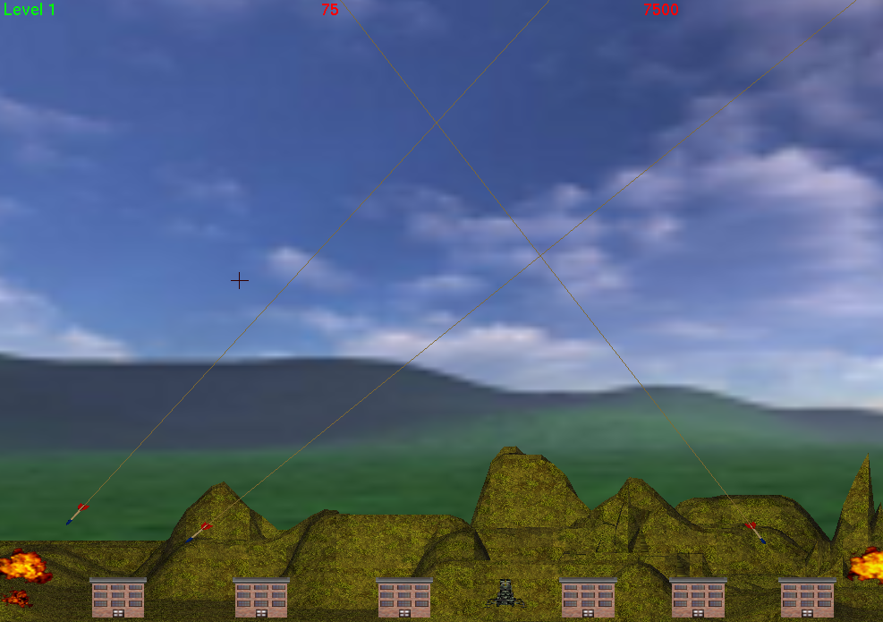

# Missile Command 3D

Remake of the game missile comand with some 3D models and a score system. Note that although theres the OpenAL requirement, the audio isn't working.

## Requeriments

- OpenGL
- OpenAL

For debian based SOs:

`sudo apt install -y freeglut3-dev libalut-dev`

## Usage

Build and run the project:

`make`

`./main`
